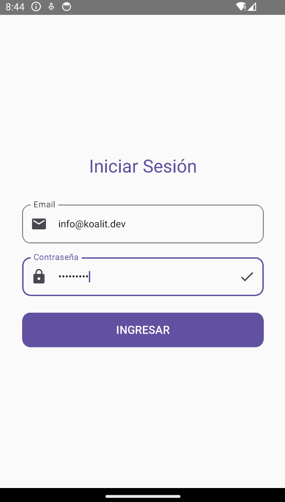
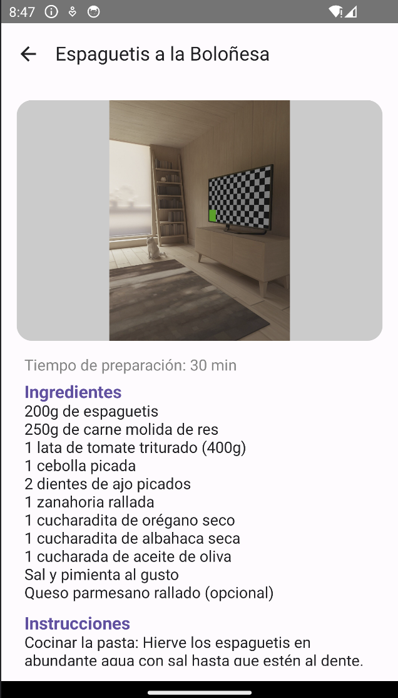

# 📌 App de Recetas 🍽️

### Descripción 📖
**App de Recetas** es una aplicación desarrollada en **Kotlin con Jetpack Compose** que permite a los usuarios agregar, visualizar y gestionar recetas de cocina de manera sencilla e intuitiva. La aplicación incluye funcionalidades avanzadas como filtrado de recetas, ordenamiento por tiempo de preparación y la opción de marcar recetas como favoritas.

---

## 🚀 Funcionalidades Principales
- 📌 **Agregar nuevas recetas** con título, descripción, tiempo de preparación, ingredientes, instrucciones y una imagen opcional.
- ⭐ **Marcar recetas como favoritas** y gestionar la lista de favoritos.
- 🔍 **Filtrar recetas** por favoritas o por tiempo de preparación (de menor a mayor).
- 🖼️ **Agregar imágenes** desde la galería para personalizar cada receta.
- 📜 **Visualizar los detalles completos de cada receta**, incluyendo ingredientes e instrucciones paso a paso.
- 🔐 **Autenticación de usuario** con inicio de sesión y persistencia de sesión.
- 🚪 **Cerrar sesión** de manera segura.

---

## 🛠️ Tecnologías Utilizadas
- **Kotlin** + **Jetpack Compose** (Diseño moderno y declarativo)
- **Room Database** (Persistencia de datos local)
- **DataStore** (Almacenamiento de estado de sesión)
- **Navigation Component** (Gestión de navegación entre pantallas)
- **Coil** (Carga y renderizado de imágenes)
- **Coroutines + Flow** (Manejo asíncrono y reactividad)

---

## 📲 Instalación y Uso
### 📌 Requisitos
- Android Studio **Giraffe o superior**
- Gradle **8.0+**
- Dispositivo o Emulador con **API 26+**

### 🔧 Clonar y ejecutar el proyecto
```sh
git clone https://github.com/Andyfer004/App_Recetas
cd app-recetas
```
1. **Abrir el proyecto** en Android Studio.
2. **Sincronizar dependencias** (`Sync Project with Gradle Files`).
3. **Ejecutar** en un emulador o dispositivo físico (`Run App`).

---

## 📷 Capturas de Pantalla
| Inicio de Sesión | Lista de Recetas | Detalle de Receta |
|-----------------|----------------|------------------|
|  |  |  |

---

## 🔜 Mejoras Futuras
- 🌎 Soporte para múltiples idiomas.
- 📲 Compartir recetas con otros usuarios.
- 🔔 Notificaciones para recordatorios de recetas guardadas.
- ☁️ Sincronización en la nube con Firebase.

---

## 🤝 Contribuciones
¡Las contribuciones son bienvenidas! Si deseas colaborar:
1. **Forkea** este repositorio 🍴.
2. **Crea una rama** con tu mejora (`git checkout -b feature/nueva-funcionalidad`).
3. **Realiza un pull request**.

---

## 📄 Licencia
Este proyecto está bajo la licencia **MIT**. Puedes ver más detalles en el archivo [`LICENSE`](LICENSE).

✍️ **Desarrollado por** [Andy](https://github.com/Andyfer004) 🚀
